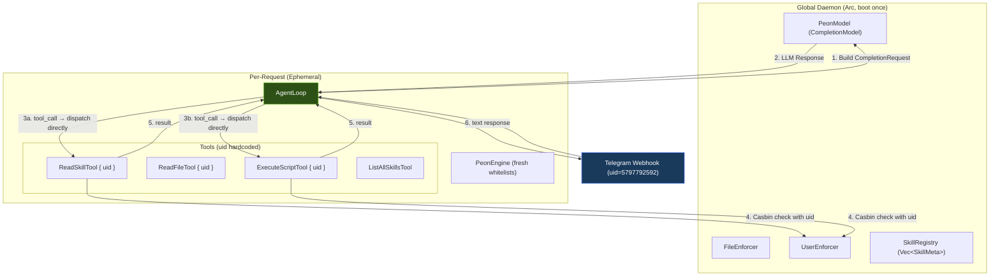

# Peon Runtime: Self-Built Agent Execution Engine

> Replacing `rig-core` with a purpose-built, zero-trust-native runtime.

## Motivation

The `rig-core` library has a fundamental architectural flaw: its `Tool` trait provides **no mechanism** for passing request-scoped context (such as `user_id`) into tool execution. Combined with its `ToolServer` pattern dispatching tools via `Arc<RwLock>`, it physically severs `tokio::task_local!` propagation. See [ADR 002](./002-rig-tool-context-limitations.md) and [rig Discussions #1298](https://github.com/0xPlaygrounds/rig/discussions/1298).

Rather than fighting `rig`'s abstractions, we build our own **minimal** agent loop that is purpose-built for Peon's zero-trust requirements: **~200 lines of Rust** that gives us full control over Context Injection, Tool Dispatch, and the Chat Loop.

## What `rig` Actually Does (And What We Need)

After studying `rig-core`'s source, the agent loop is conceptually simple:

```
1. Collect: system_prompt + chat_history + user_prompt + tool_definitions
2. Send to LLM API (OpenAI-compatible /chat/completions)
3. Parse response:
   - If response contains tool_calls → execute tools → append results → GOTO 2
   - If response contains text → return to user
4. Repeat until max_turns exceeded or text response received
```

Everything else in `rig` (ToolServer, AgentBuilder type-state, PromptHooks, RAG indexing, streaming, WASM compat) is **not needed** for Peon's MVP.

## What We Keep From `rig`

> [!IMPORTANT]
> We **keep `rig-core` as a dependency** solely for `PeonModel` (our multi-provider enum dispatch). This is the only piece that is genuinely complex and not worth rewriting. We stop using `rig`'s `Agent`, `AgentBuilder`, `Tool` trait, and `ToolServer` entirely.

Specifically, we continue using:

- `rig::completion::CompletionModel` — the trait that `PeonModel` implements
- `rig::completion::CompletionRequest` — the request struct we build manually
- `rig::completion::CompletionResponse` — what comes back from the LLM
- `rig::completion::ToolDefinition` — the JSON schema struct for tool definitions
- `rig::completion::Message` — the chat message types
- `rig::message::*` — `AssistantContent`, `UserContent`, `ToolCall`, etc.

We **delete** usage of:

- `rig::agent::Agent`
- `rig::agent::AgentBuilder`
- `rig::tool::Tool` (replaced by our own `PeonTool` trait)
- `rig::tool::server::ToolServer`
- `rig::completion::Prompt` / `Chat` traits

## Architecture



## Execution Flow (Detailed)

```mermaid
sequenceDiagram
    participant TG as Telegram
    participant Loop as AgentLoop
    participant LLM as PeonModel (LLM API)
    participant Tool as PeonTool::call()
    participant Casbin as UserEnforcer

    TG->>Loop: prompt("骰128面", uid="744...")

    loop max_turns
        Loop->>Loop: Build CompletionRequest<br/>(system + history + tools JSON)
        Loop->>LLM: model.completion(request)
        LLM-->>Loop: CompletionResponse

        alt Response has tool_calls
            loop for each tool_call
                Loop->>Tool: tool.call(args, &context)
                Tool->>Casbin: enforce(uid="744...", "execute", path)
                Casbin-->>Tool: allow/deny
                Tool-->>Loop: result string / error
            end
            Loop->>Loop: Append tool results to history
        else Response has text only
            Loop-->>TG: Return text response
        end
    end
```

## The New `PeonTool` Trait

The key design change: our trait receives a **`&RequestContext`** alongside args.

```rust
/// Request-scoped context passed to every tool invocation.
/// This is the "uid injection" that rig's Tool trait lacks.
pub struct RequestContext {
    /// The authenticated user ID (e.g., Telegram chat_id).
    /// Hardcoded at request creation time, immutable, unforgeable by LLM.
    pub uid: String,
}

/// A Peon tool that receives request-scoped context.
/// Unlike rig's `Tool` trait, this gives tools access to the caller's identity.
#[async_trait::async_trait]
pub trait PeonTool: Send + Sync {
    /// Tool name (must be unique within a toolset).
    fn name(&self) -> &str;

    /// JSON Schema definition sent to the LLM.
    async fn definition(&self) -> ToolDefinition;

    /// Execute the tool with the given JSON args and request context.
    async fn call(&self, args: &str, ctx: &RequestContext) -> Result<String, ToolCallError>;
}
```

> [!TIP]
> This is the **entire reason** we're replacing rig. By adding `ctx: &RequestContext` to `call()`, the UID is passed directly in the function signature. No task-local, no RwLock, no race condition. The LLM can never touch `ctx` — it only controls `args`.

## The `AgentLoop`

The core loop is ~100 lines. Pseudocode:

```rust
pub struct AgentLoop {
    model: PeonModel,
    system_prompt: String,
    tools: Vec<Box<dyn PeonTool>>,
    max_turns: usize,
}

impl AgentLoop {
    pub async fn run(
        &self,
        prompt: &str,
        chat_history: &[Message],
        ctx: &RequestContext,
    ) -> Result<String, AgentError> {
        let mut messages = chat_history.to_vec();
        messages.push(Message::user(prompt));

        for _turn in 0..self.max_turns {
            // 1. Build tool definitions
            let tool_defs: Vec<ToolDefinition> = /* collect from self.tools */;

            // 2. Build CompletionRequest
            let request = CompletionRequest { /* ... */ };

            // 3. Send to LLM
            let response = self.model.completion(request).await?;

            // 4. Parse response
            let (tool_calls, texts) = partition_response(&response);

            // Append assistant message to history
            messages.push(Message::assistant(response.choice));

            if tool_calls.is_empty() {
                // 5a. Pure text → return
                return Ok(merge_texts(texts));
            }

            // 5b. Execute tool calls (sequentially for v1, concurrent later)
            let mut tool_results = vec![];
            for tc in &tool_calls {
                let tool = self.find_tool(&tc.name)?;
                let result = tool.call(&tc.args, ctx).await; // <-- UID injected here!
                tool_results.push(ToolResult { id: tc.id, content: result });
            }

            // 6. Append tool results as user message
            messages.push(Message::tool_results(tool_results));
        }

        Err(AgentError::MaxTurnsExceeded)
    }
}
```

## Module Structure

```
peon-core/src/
├── lib.rs
├── agent_loop.rs      ← NEW: ~150 lines, the core loop
├── peon_tool.rs        ← NEW: ~50 lines, PeonTool trait + RequestContext
├── peon_model.rs       ← KEEP: multi-provider enum dispatch (uses rig internally)
├── scanner.rs          ← KEEP: skill scanning, PeonEngine, whitelists
├── tools.rs            ← MODIFY: implement PeonTool instead of rig::tool::Tool
├── enforcer.rs         ← KEEP: Casbin enforcers (untouched)
├── agent.rs            ← REWRITE: PeonFoundation + builder using AgentLoop
└── setup.rs            ← KEEP: workspace init (untouched)
```

## Dependency Changes

```diff
# peon-core/Cargo.toml
[dependencies]
- rig-core = "0.33.0"
+ rig-core = "0.33.0"     # kept for CompletionModel + Message types only
+ async-trait = "0.1"      # for PeonTool trait (async fn in trait)
```

> [!NOTE]
> We do **not** remove `rig-core`. We strip it down to a "dumb HTTP adapter" — we only use its `CompletionModel::completion()` method to talk to LLM APIs, and its `Message`/`ToolDefinition` types for data structures. All orchestration logic (agent loop, tool dispatch, context passing) is ours.

## What This Buys Us

| Problem                   | rig                                          | Peon Runtime                                        |
| ------------------------- | -------------------------------------------- | --------------------------------------------------- |
| UID propagation to tools  | ❌ Impossible (ToolServer severs task-local) | ✅ `ctx: &RequestContext` in every `call()`         |
| Concurrent user isolation | ❌ RwLock race condition                     | ✅ Each request has its own `RequestContext`        |
| Chat history management   | ❌ Not built-in (must reinvent)              | ✅ First-class `chat_history: &[Message]` parameter |
| Code complexity           | ~5000 LOC across 15+ files                   | ~200 LOC across 2 new files                         |
| Debugging                 | Opaque ToolServer + tracing spans            | Direct `log::info!` in a flat loop                  |

## Estimated Effort

- `peon_tool.rs` (new): **~50 lines** — trait + RequestContext struct
- `agent_loop.rs` (new): **~150 lines** — the loop + CompletionRequest builder
- `tools.rs` (modify): **~30 lines changed** — swap `impl Tool for X` → `impl PeonTool for X`
- `agent.rs` (rewrite): **~80 lines** — PeonFoundation + simplified builder
- Tests: **~50 lines changed** — update tool constructors

**Total: ~200 new lines, ~160 lines modified. One afternoon of focused work.**

## Open Design Questions

> [!IMPORTANT]
>
> 1. **Do we need `async-trait` or can we use RPITIT (return position impl trait)?**
>    Since the project uses `edition = "2024"`, native `async fn` in traits is stable. We can skip `async-trait` entirely and just use `fn call(...) -> impl Future<...> + Send`. This is cleaner but requires all implementors to be `Send + Sync`.
> 2. **Sequential vs concurrent tool execution?**
>    For MVP, sequential tool execution is safest (one tool at a time). rig does concurrent via `buffer_unordered`. We can add this later without breaking changes.
> 3. **Should `PeonTool::definition()` also receive `&RequestContext`?**
>    Currently rig passes the prompt string to `definition()` so the tool can dynamically adjust its schema (e.g., update whitelisted paths). We should pass `ctx` here too for consistency, but it's optional for MVP.
